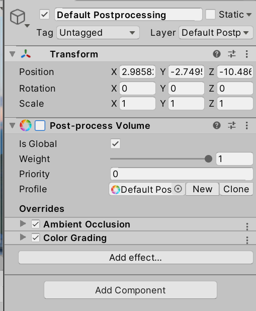

Fitur:
1. Player:
   - Gabisa gerak (view kamera aja) ✅
   - Controlling Senjata ✅
   - Bisa Teleport/Pindah Posisi (bukan jalan tapi kek pindah basecamp)✅
   - Kurang lebih ada 3 basecamp (misal musuh A gakeliatan dari view basecamp 1, teleport ke basecamp 2 baru bisa liat musuh A)
3. Weapon:
   - Mekanisme Sniper, Kamera, dan segala efeknya ✅
   - Reload ✅
   - Peluru ✅
   - Suara ✅
   - Keknya ga ditampilin
   - Tambah Efek Getaran pas nembak
   - Bongkar Sniper aslinya ✅
5. Enemy:
   - Masih Kaku ✅
   - Ganti Model Musuh✅
   - Animasi Musuh Jalan
   - Animasi Musuh Ketembak ✅
6. UI:
   - Main Menu
   - Lokasi Musuh 
   - Perintilan (Jumlah Peluru, Peringatan, DLL)
7. World:
   - Masih template ✅
   - Bagusin Terrain + Tata letak kota ✅
   - Penempatan Musuh + Jumlah Musuh
8. Reward & Punishment:
   - Gatau masih belum kebayang
   - mentok paling sistem point
   - Punishment belum kebayang
   
Catatan:
Kalo bukan versi 2019, matiin post processing biar ga blank pas nembak:

Buat Controll, di Player:
2 yang atas control dari arduino
2 yang bawah control dari mouse + keyboard

